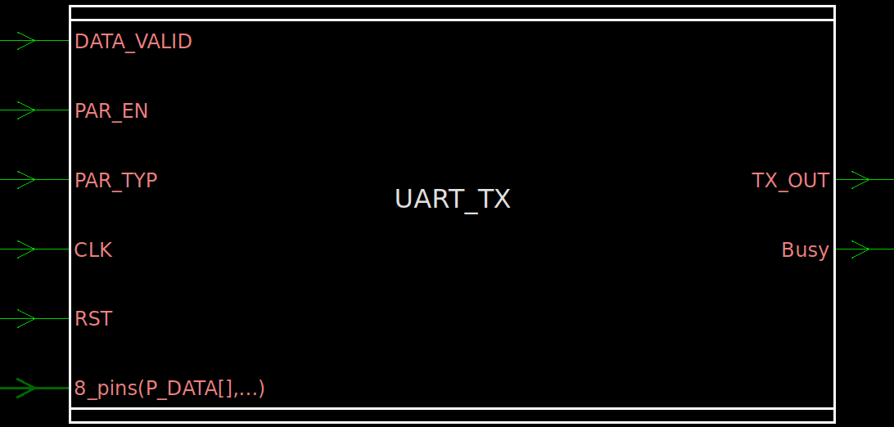
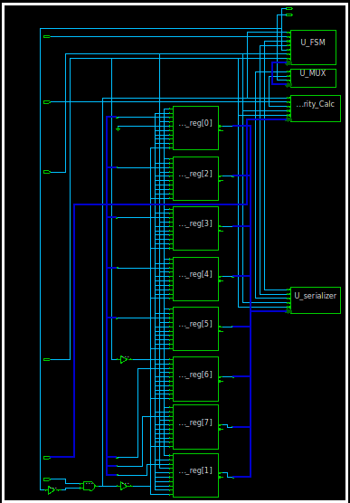
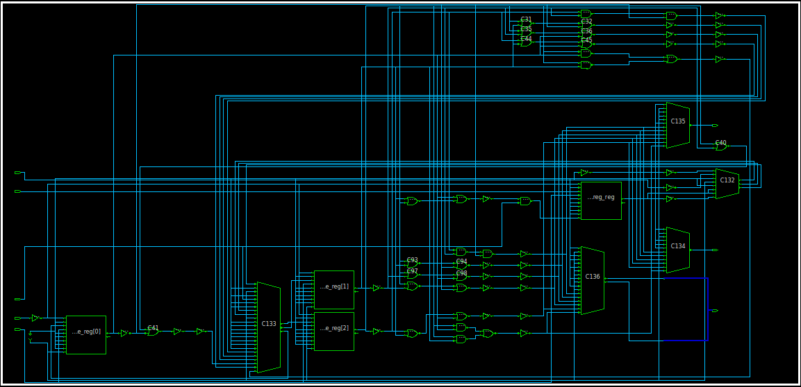
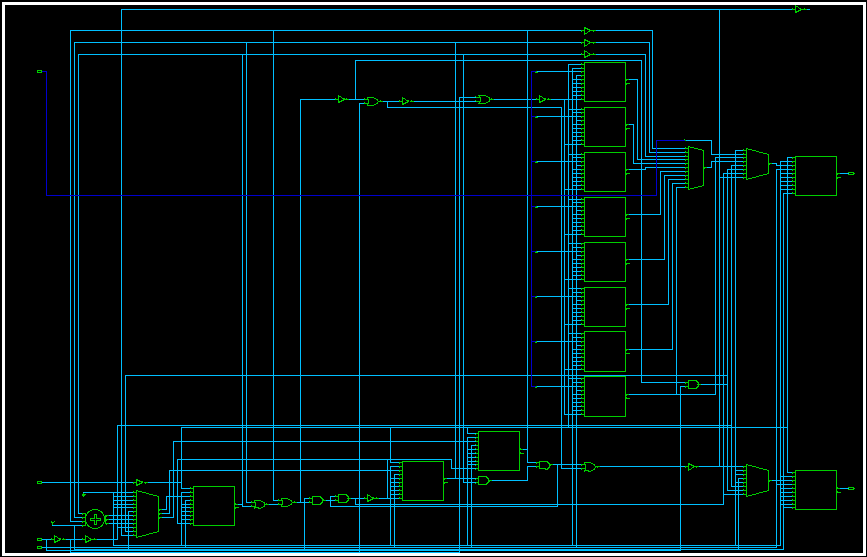
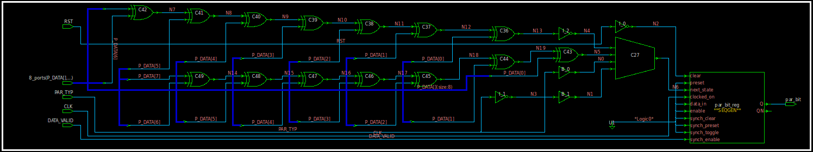
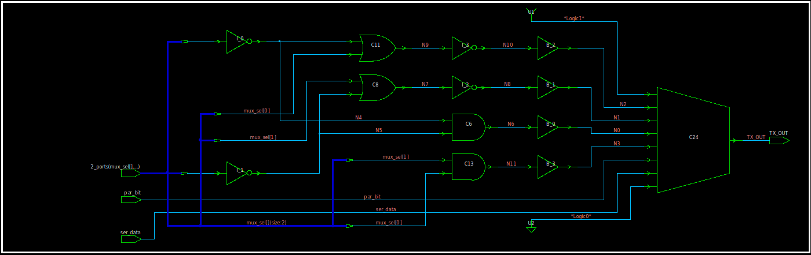
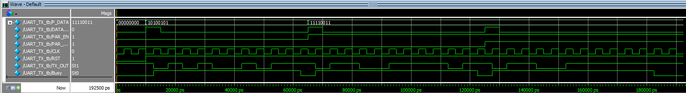

# UART Transmitter (UART_TX) — Verilog

A configurable UART transmitter built from four cooperating blocks — a control **FSM**, a bit **Serializer**, a **Parity Calculator**, and an output **MUX** — that frames 8-bit parallel data into a serial start/data/parity/stop bitstream.

<p align="center">
  
</p>

## Architecture

<p align="center">
  
</p>

| Sub-block      | Role                                                                 |
|-----------------|------------------------------------------------------------------------|
| `FSM`           | Sequences the frame through IDLE → START → DATA → (PARITY) → STOP, drives `ser_en`, `mux_sel`, and `Busy` |
| `serializer`    | Shifts the 8-bit data word out one bit at a time, LSB first, and signals `ser_done` |
| `parity_Calc`   | Computes even/odd parity over `P_DATA`, registered on data acceptance   |
| `MUX`           | 4-to-1 output mux selecting the start bit, data bit, parity bit, or stop bit onto `TX_OUT` |

## Top-Level Port List (`UART_TX`)

| Signal        | Direction | Width | Description                                              |
|---------------|-----------|-------|-------------------------------------------------------------|
| `P_DATA`      | Input     | [7:0] | Parallel data to transmit                                   |
| `DATA_VALID`  | Input     | 1     | Requests a new transmission (accepted only when idle)        |
| `PAR_EN`      | Input     | 1     | Enables a parity bit in the frame                            |
| `PAR_TYP`     | Input     | 1     | Parity type: `0` = even, `1` = odd                           |
| `CLK`         | Input     | 1     | Clock                                                        |
| `RST`         | Input     | 1     | Asynchronous reset, **active low**                            |
| `TX_OUT`      | Output    | 1     | Serial data output                                            |
| `Busy`        | Output    | 1     | High while a frame is being transmitted                       |

## Frame Format

```
[ START (0) ] [ D0 D1 D2 D3 D4 D5 D6 D7 ] [ PARITY (optional) ] [ STOP (1) ]
```

- Start bit is always `0`; stop bit is always `1`.
- Data is sent **LSB first**.
- The parity bit is only inserted when `PAR_EN` was asserted at the moment the frame was accepted.

## Design Behavior

- New data is accepted only when the transmitter is idle: `data_accept = DATA_VALID && !Busy`. On acceptance, `P_DATA` and the `PAR_EN` setting for that frame are latched (so changing `PAR_EN` mid-frame has no effect).
- The **FSM** walks through `IDLE → START → DATA → PARITY (if enabled) → STOP → IDLE`, asserting `Busy` for the whole frame and selecting what the MUX outputs at each stage.
- The **serializer** only runs while `ser_en` is high (during the `DATA` state), shifting out `P_DATA[0]` through `P_DATA[7]` and asserting `ser_done` on the last bit.
- The **parity calculator** computes `^P_DATA` (even) or `~^P_DATA` (odd), registered when the frame is accepted.
- The **MUX** selects between the fixed start bit, the fixed stop bit, the current serializer bit, or the parity bit based on the FSM's `mux_sel`.

## Sub-Unit Details

### FSM
<p align="center">
  
</p>

5-state Moore machine (`IDLE`, `START`, `DATA`, `PARITY`, `STOP`) that drives `ser_en`, `Busy`, and the 2-bit `mux_sel`, and skips the `PARITY` state entirely when parity is disabled for the current frame.

### Serializer
<p align="center">
  
</p>

8-bit parallel-in/serial-out shift register, LSB-first, enabled by `ser_en` and reporting completion via `ser_done`.

### Parity Calculator
<p align="center">
  
</p>

Registers either the XOR-reduction (even parity) or its complement (odd parity) of `P_DATA` when a new frame is accepted.

### MUX
<p align="center">
  
</p>

4-to-1 mux placing the start bit, stop bit, serial data bit, or parity bit onto `TX_OUT` according to the FSM's `mux_sel`.

## Testbench

`UART_TX_tb.v` drives a free-running clock (5 ns period) and runs three back-to-back frames, waiting for `Busy` to fall before starting the next:

| Test Case | Data   | Parity        | Purpose                          |
|-----------|--------|---------------|-------------------------------------|
| 1         | `0xA5` | Disabled      | Basic frame with no parity bit       |
| 2         | `0xF3` | Even (`PAR_TYP=0`) | Frame with even parity          |
| 3         | `0xF3` | Odd (`PAR_TYP=1`)  | Same data with odd parity — confirms the parity bit flips |

A `$monitor` prints `RST`, `P_DATA`, `DATA_VALID`, `PAR_EN`, `PAR_TYP`, `Busy`, and `TX_OUT` on every change.

### Sample Transcript Output

```
Time=63000  | RST=1 | P_DATA=f3 | VALID=0 | PAR_EN=1 | PAR_TYP=0 | Busy=1 | TX_OUT=0
Time=113000 | RST=1 | P_DATA=f3 | VALID=0 | PAR_EN=1 | PAR_TYP=1 | Busy=1 | TX_OUT=0
Time=183000 | RST=1 | P_DATA=f3 | VALID=0 | PAR_EN=1 | PAR_TYP=1 | Busy=0 | TX_OUT=1
```

### Waveform

<p align="center">
  
</p>

## Running the Simulation (ModelSim / QuestaSim)

```tcl
cd RTL
do run.do
```

`run.do` compiles all five source files, launches `UART_TX_tb`, loads `wave.do` (which preloads `P_DATA`, `DATA_VALID`, `PAR_EN`, `PAR_TYP`, `CLK`, `RST`, `TX_OUT`, and `Busy`), and runs the full simulation.

## Linting

The design was checked with **Synopsys SpyGlass** (`Lint/Lint.prj`, `rtl_handoff` methodology). The `moresimple` report came back clean — no lint violations.

## Repository Structure

```
.
├── RTL/
│   ├── UART_TX.v            # Top-level UART transmitter
│   ├── UART_TX_tb.v         # Testbench (3 frame test cases)
│   ├── FSM.v                # Control FSM
│   ├── serializer.v         # Parallel-to-serial shifter
│   ├── parity_Calc.v        # Even/odd parity generator
│   ├── MUX.v                # 4-to-1 output mux
│   ├── run.do                # Compile + simulate script
│   ├── wave.do                # ModelSim/QuestaSim waveform config
│   └── transcript             # Simulation log
├── Lint/
│   ├── Lint.prj              # SpyGlass lint project file
│   └── moresimple.rpt        # SpyGlass lint report
├── images/
│   ├── UART_TX.png            # Block symbol
│   ├── UART_TX_TOP.png        # Top-level RTL schematic
│   ├── FSM.png                # FSM RTL schematic
│   ├── Serializer.png         # Serializer RTL schematic
│   ├── Parity_calc.png        # Parity calculator RTL schematic
│   ├── MUX.png                 # MUX RTL schematic
│   ├── Transcript.png          # Simulation log (screenshot)
│   └── WaveForm.png             # Simulation waveform
├── LICENSE
└── README.md
```

## License

See [LICENSE](LICENSE) for details.
